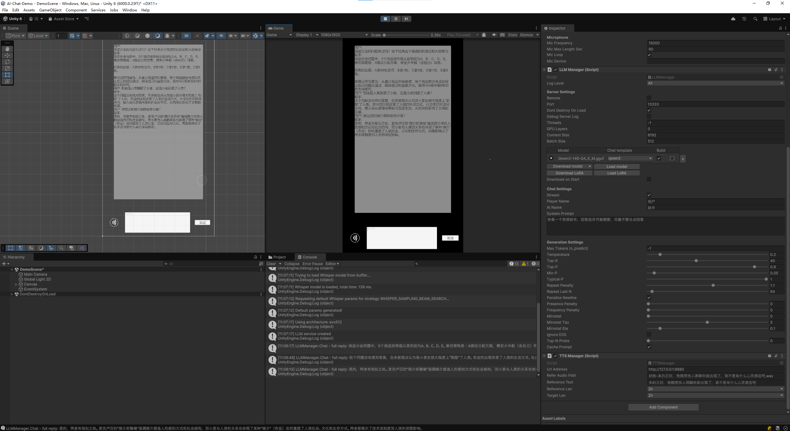

## AI Chat Demo
[English Version](README.md)
&emsp;&emsp;这是一个整合了本地语音文字互转及大语言模型对话的项目。语音转文字由[whisper.unity](https://github.com/Macoron/whisper.unity)实现，大语言模型对话由[LLM for Unity](https://github.com/undreamai/LLMUnity)实现，文字转语音由[GPT-SoVITS](https://github.com/RVC-Boss/GPT-SoVITS)实现。
&emsp;&emsp;项目将这三个功能分为三个Manager控制：STTManager，LLMManager，TTSManager。其中STTManager调用的模型位置在(Assets/StreamingAssets/Whisper)中，初始只有Tiny模型可用，识别能力一般，需要更大模型可自行下载，放入指定位置并正确命名(ggml-<type>.bin)。LLMManager所使用的模型可在Inspector中下载，亦或下载其他模型导入。提示词也可自行更改。TTSManager相对复杂一些，需要复制go_webui.bat并把调用的webui.py zh_CN改为文件中的api.py，之后启用服务即可。

 